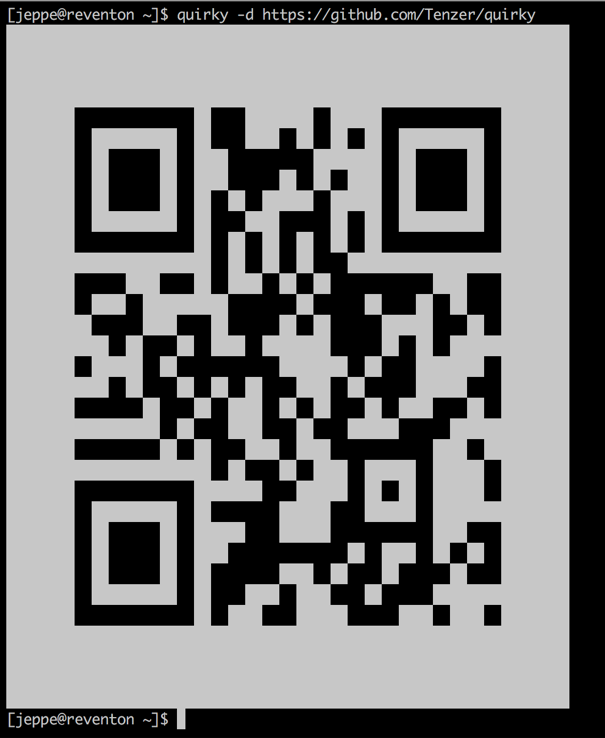

# QuiRky

A command line QR code printer inspired by "because I can" mentality and "not invented here" syndrome.


## Usage

```
$ quirky --help
Usage: quirky [options] [text | -]

  Specify "-" or just nothing to read from stdin.

Options:
  -d    Make QR code double size
  -i    Invert colors
```


## Screenshots




## Installation

If you have [Go](https://golang.org/) installed, then you should simply run:

```
go get github.com/Tenzer/quirky
```

and you will get the `quirky` executable inside `$GOPATH/bin`.


## Change log

### 1.0.0 - 2016-06-09
* Initial release
